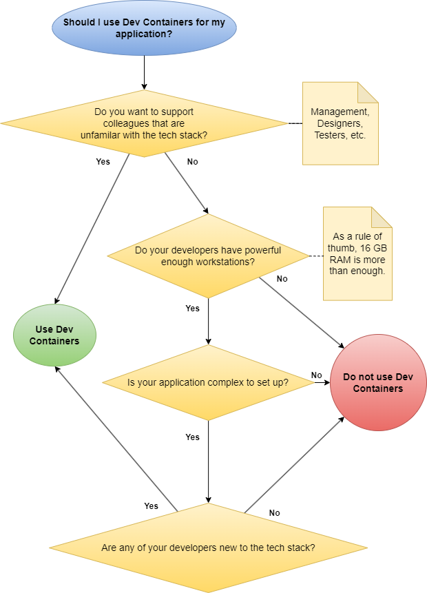

## Introduction

[Dev Containers](https://containers.dev/) is an open specification that allows for a reproducible,
containerized development environment using Docker.
It was originally developed for Visual Studio Code, but later
expanded to allow for multiple implementations.

Dev Containers allow you to use Dockerfiles, Docker Compose, Docker Volumes,
and everything else we love about Docker to design and share development environments.

They seem appealing at first; Dev Containers should give all of the developers a
level playing field, and allow you to configure a development environment as code.
There are drawbacks though; Dev Containers are not the right fit for every team.
In this post, I will give you some pointers as to whether or not Dev Containers
are good for your team.

## Flowchart Overview

|  |
|:-:|
|A flowchart to aid in deciding whether Dev Containers are right for you|

## Immediate Reasons to use Dev Containers

The only immediate reason to opt for a Dev Container is if you wish to
support more non-techical users. Here are some scenarios that make Dev Containers valuable:

- A designer wants to run the application locally to assess it or slightly tweak the frontend

- A manager wants to see the state of the application in development

- Testers want their own instance of the application to test against

If you encounter any of these often, then absolutely opt to use or at least support Dev Containers.

If you don't, then Dev Containers may still have a place on your team - continue reading.

## Reasons not to use Dev Containers

### Not Enough Resources (Windows/MacOS)

Dev Containers are subject to virtualization overhead on every OS
except for Linux. If you have a weak workstation, then you will notice it.

Your intellisense and syntax highlighting will be slow. IDE features will work
slowly, if at all.

You may convince yourself that it isn't a big deal, but it will erode away at you over
time and annoy you. There is nothing worse than an annoying dev environment.

A good rule of thumb is that you have should **16 GB RAM** to use Dev Containers.

### Application not Worth the Added Complexity

Some applications are so simple to develop that Dev Containers are overkill.
For example, let us look at a modern Node.js frontend.

These are the necessary steps to develop this application on your host machine.

1. Install [Node Version Manager](https://github.com/nvm-sh/nvm) ([Windows](https://github.com/coreybutler/nvm-windows))

    Node Version Manager is optional, but every Node.js dev will wish they had it.
    It allows you to use multiple versions of Node.js, and isolate these versions
    from eachother.

2. Install Node.js

    ```bash
    nvm install 20.14.0
    nvm use 20.14.0
    ```

3. Install dependencies

    ```bash
    npm install
    ```

4. Run dev server

    ```bash
    npm run dev
    ```

That's it. We are running the application. Node Version Manager is isolating the Node.js
version for us, and `node_modules` is isolating our dependencies from other projects. There is nothing
more that Dev Containers can do for us here. For this application, I would not recommend Dev Containers.

For another application, however, such as a REST API, you will probably be required to connect to MongoDB, MySQL, Redis,
or some other external program. Applications like these are perfect for Dev Containers.

### Entire Team is Proficient in the Technology

If your entire team is very proficient in the technology you are using, Dev Containers
are restrictive.

Let's look at Python for example. There are a lot of pitfalls regarding Python,
mainly due to its old ecosystem and the unintuitive way it manages dependencies.
For those uninitiated in Python, Dev Containers can make Python development a lot
less scary, and make onboarding a lot easier.

Once a developer is proficient in Python, they have good knowledge of how it all
works. They are used to Python conventions and idioms, and very well know how to
manage Python dependencies. If you give one of these developers a Dev Container
that abstracts away all of this stuff, they will be impeded.

A proficient Python developer won't see the point in their Dev Container.
To them, it will be overhead - both cognitive AND computational.

If your entire team knows what they are doing, Dev Containers will do more harm
than good.

## Conclusion

Dev Containers can make lives easier, but only when necessary. Implementing them
can greatly ease the onboarding process and make the application more accessible,
but they can also make the development process more restrictive or unnecessary complex.

If you consider the above reasons, and are still leaning towards Dev Containers, I highly recommend them.
