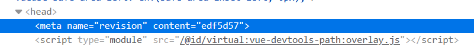

## Introduction

[Vite](https://vitejs.dev/) is a build tool and a bundler. You write your code, import dependencies, define assets, and Vite
will turn it into an amalgamation of JavaScript, CSS, and HTML that can be served to a browser.

Vite exposes its configuration as code in a file called `vite.config.js`. This file runs in Node.js which means
that anything you can do in Node.js, you can do in your Vite configuration. You can import files, run commands,
and even make HTTP requests. **This even works for web based applications** - even if your source code runs in a browser
environment, your `vite.config.js` will **always** run in Node.js.

This is an example `vite.config.js` file:

```javascript
import path from 'path'
import { defineConfig } from 'vite'
import vue from '@vitejs/plugin-vue'

export default defineConfig({
  plugins: [vue()],
  server: {
    port: 3000,
    open: true // open the browser when the server starts
  },
  build: {
    outDir: 'dist',
    sourcemap: true
  },
  resolve: {
    alias: {
      '@': path.resolve(__dirname, 'src')
    }
  }
})
```

This file configures Vite to use Vue.js, open a development server on port 3000, and output the build to a `dist` directory. It also allows you to use the `@` alias to refer to the `src` directory.
This configuration uses an external plugin for Vue.js, but you can also write your own plugins.

Sometimes installing third-party plugins is not ideal. Maybe you are concerned about maintenance, security, or performance. Writing your own plugin is easier than you think, and it can be a lot of fun.

## Plugin: `vite-plugin-revision`

When you deploy code to production, you want to make sure that the version of your application that _you think_ is running is actually running. What if the CI/CD pipeline has a bug, or the deployment script is broken? This is especially important if you are delivering small updates to your application, where it is not immediately obvious if the update has been deployed.

This plugin will expose the current git commit hash to your application as an environment variable:

### vite.config.js

```javascript
import { execSync } from 'child_process'
import { defineConfig } from 'vite'
import vue from '@vitejs/plugin-vue'

const commitHash = execSync('git rev-parse --short HEAD')
  .toString()
  .trim();

export default defineConfig({
  plugins: [
    {
      name: 'vite-plugin-revision',
      config: () => ({
        define: {
          'import.meta.env.REVISION': JSON.stringify(commitHash),
        },
      })
    }
  ]
});
```

You can now access the commit hash in your application. This is an example of displaying it in a Vue.js component:

### App.vue

```javascript
<template>
  <div>
    <h1>Welcome to my Application</h1>
    <p>Revision: {import.meta.env.REVISION}</p>
  </div>
</template>
```

And this is what it looks like in the browser:


This is great for developers, and open-source projects often expose the revision hash in the UI of the application.
What if your user base wouldn't care about the revision hash, and only developers need to see it?
You can use a Vite plugin to inject the revision hash into the HTML `<head>` tag:

```javascript
import { execSync } from 'child_process'
import { defineConfig } from 'vite'
import vue from '@vitejs/plugin-vue'

const commitHash = execSync('git rev-parse --short HEAD')
  .toString()
  .trim();

export default defineConfig({
  plugins: [
    {
      name: 'vite-plugin-inject-revision',
      transformIndexHtml(html) {
        return html.replace(
          /<head>/,
          `<head>\n    <meta name="revision" content="${commitHash}">`
        );
      }
    }
  ]
});
```

This way, developers can easily see the revision in the browser's developer tools, but it is not exposed to end users. This is how it looks in DevTools:



Let's say that, for security reasons, you don't want to expose a revision hash at all. Plugins can still be useful here. **Remember that you have all of Node.js at your disposal**. You can do a double hash of the revision hash:

```javascript
import { execSync } from 'child_process'
import crypto from 'crypto'
import { defineConfig } from 'vite'
import vue from '@vitejs/plugin-vue'

const commitHash = execSync('git rev-parse --short HEAD')
  .toString()
  .trim();

const doubleHash = crypto.createHash('sha256').update(commitHash).digest('hex');

export default defineConfig({
  plugins: [
    {
      name: 'vite-plugin-inject-revision',
      transformIndexHtml(html) {
        return html.replace(
          /<head>/,
          `<head>\n    <meta name="revision" content="${doubleHash}">`
        );
      }
    }
  ]
});
```


This way, end users could not reverse-engineer the revision hash from the source code. Developers can still check that the correct
revision is running by hashing the revision hash themselves:

```sh
REVISION=$(git rev-parse --short HEAD)
echo $REVISION # edf5d57

# 7203a614a00b8e6446777f37467c8e9a456f62a7112a596a233d71687a57a91e
echo -n $REVISION | sha256sum
```

With just a few lines of code, and no external dependencies, you've enhanced the observability of your application
while optionally keeping sensitiv information private. Vite plugins can give your developers peace of mind,
and they can easily automate arbitrary tasks in Node.js.

## Plugin: Random _xkcd_ Comic

The stereotype is that developers love [_xkcd_](https://xkcd.com/). You can find these everywhere online, they are often used in presentations and meeting icebreakers. Imagine you are writing a blog post about Vite plugins, and you want to include a random _xkcd_ comic at the end of the post. Sure, we could just link to their website, but what if we want to reduce time to load the page? What if want to be polite to _xkcd_ and not hotlink their images? What if we want to cache the image locally?

In order to do this, we would need to:

1. Fetch a random _xkcd_ comic image

2. Inject it into the HTML

This blog is written in [Astro](https://astro.build/), which uses Vite under the hood. We can use a Vite plugin to fetch the comic and inject it into the HTML. This plugin will download a random _xkcd_ comic and inject it into the HTML by replacing a comment:

### `astro.config.mjs`

```javascript
import { defineConfig } from 'astro/config';
import fs from 'fs';

export default defineConfig({
  vite: {
    plugins: [
      {
        name: 'vite-plugin-random-xkcd',
        async buildStart() {
          const latestRes = await fetch('https://xkcd.com/info.0.json');
          const { num } = await latestRes.json();
          const randomComicId = Math.floor(Math.random() * num) + 1;

          const randomRes = await fetch(`https://xkcd.com/${randomComicId}/info.0.json`);
          const { img } = await randomRes.json();
          const image = await fetch(img);
          const buffer = await image.arrayBuffer();

          fs.mkdirSync('public/xkcd', { recursive: true });
          fs.writeFileSync(`public/xkcd/random.png`, Buffer.from(buffer));
        }
      },
    ],
  },
});
```

This is a silly and fun use case, but there are real applications for network calls in Vite plugins. You can fetch data from an API, download assets lazily but cache them locally. Vite plugins can be a great start into feature flagging (although I do recommend eventually moving to a more robust solution). When you can run commands and hit endpoints in your Vite configuration, the possibilities are endless.

## Conclusion

Vite plugins are powerful and easier to write than you think. You can use them to inject environment variables, download assets, and even fetch data from the internet. You can use them to increase observability in your application, or to reduce load times. You can write a useful plugin in just a few lines of code, and you can do it without any external dependencies.

Don't be afraid to write your own Vite plugins. They are a great way to extend Vite to fit your needs, and they can be a lot of fun to write.

|  |
|:--:|
